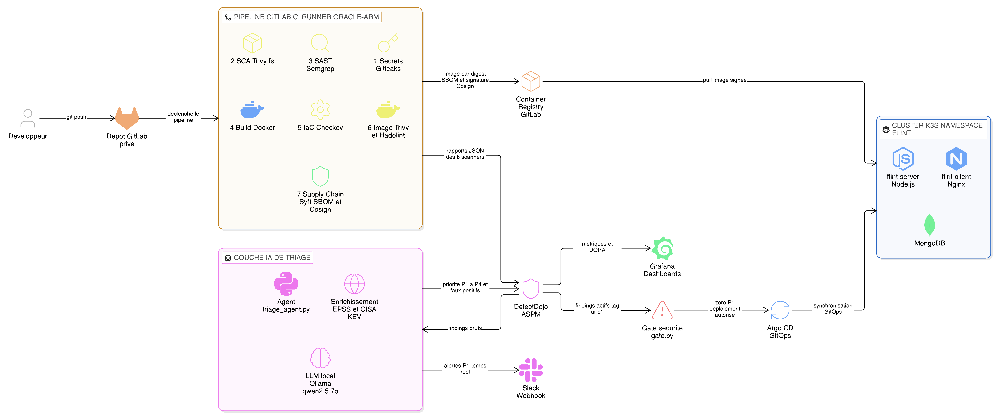
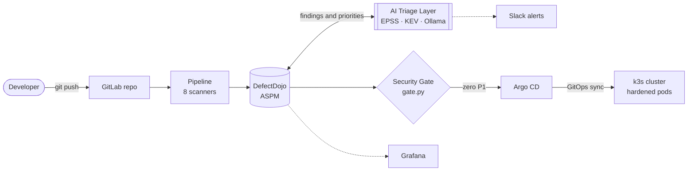
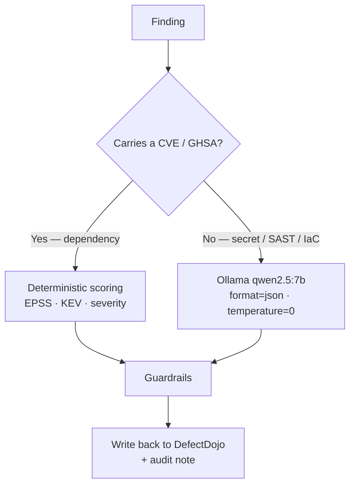

# 🛡️ Intelligent DevSecOps Framework

> An end-to-end **secure CI/CD pipeline** augmented with a **local‑LLM triage layer** that prioritizes vulnerabilities by their **real‑world exploitability** — not by raw CVSS.


This project is a complete, working DevSecOps platform built on **free ARM infrastructure** (Oracle Cloud Ampere). It integrates eight security scanners into a GitLab CI pipeline, aggregates every finding into **DefectDojo (ASPM)**, and adds an **AI triage agent** that combines EPSS + CISA KEV threat intelligence with a local language model to answer the question scanners never do: *“which of these hundreds of findings actually matters?”*

The framework is demonstrated on **`flint_commerce`**, a real MERN e‑commerce application, but it is **application‑agnostic** — the whole pipeline is driven by `.gitlab-ci.yml` and a handful of environment variables.

---

## 🏗️ Architecture



The framework is organized as six successive planes — each consumes the previous one's output and enriches it, turning **raw scanner data into a deploy/block decision**:



---

## ✨ What makes it different

Most “DevSecOps” projects stop at *“I added scanners to my pipeline.”* The hard part starts right after: a single scan of a real app produces **hundreds of findings**, poorly ranked by theoretical CVSS. Teams drown, disable the gate, and security becomes theater.

This framework attacks that problem head‑on:

| Capability | How |
|---|---|
| 🎯 **Exploitability‑based priority** | An `EPSS` score (probability of exploitation) + the `CISA KEV` catalog (proven exploited) override raw CVSS. A KEV / high‑EPSS CVE becomes **P1**; a “Critical” with no known exploit sinks in the queue. |
| 🧠 **Hybrid AI triage** | CVE findings → deterministic scoring (fast, reproducible). Non‑CVE findings (secrets, SAST, IaC) → local LLM judgment, where context actually matters. |
| 🚧 **Guardrailed AI** | Four guardrails ensure the 7B model **can never hide a real vulnerability** — including *“a finding carrying a CVE/GHSA id is never a false positive.”* |
| ⛔ **Intelligent gate** | The pipeline blocks only on findings the AI ranked **P1** — a `sk_test_…FAKE` placeholder never blocks a release, an actively‑exploited medium‑severity CVE does. |
| 🔗 **Supply‑chain integrity** | Every image ships an SBOM (CycloneDX) and is signed by digest with Cosign. |
| 🚀 **GitOps least privilege** | The CI has **zero cluster access**; Argo CD pulls from Git. A compromised pipeline cannot run arbitrary workloads. |

---

## 🔧 The pipeline (10 stages)

| # | Stage | Tool | Surface covered |
|---|---|---|---|
| 1 | `secrets` | **Gitleaks** | Secrets across the **full Git history** |
| 2 | `sca` | **Trivy fs** | Vulnerable npm dependencies |
| 3 | `sast` | **Semgrep** | Vulnerable code patterns |
| 4 | `build` | **Docker/BuildKit** | Multi‑stage build, push **by digest** |
| 5 | `iac` | **Checkov** | Kubernetes manifest misconfigurations |
| 6 | `container-scan` | **Trivy image** + **Hadolint** | Image OS packages + Dockerfile quality |
| 7 | `supply-chain` | **Syft** + **Cosign** | SBOM + cryptographic signature |
| 8 | `upload` | **DefectDojo API** | Aggregate all 8 reports |
| 9 | `ai-triage` | **triage_agent.py** + **Ollama** | Prioritize by exploitability |
| 10 | `gates` | **gate.py** | Block on real P1 priorities |

> Scanners run with `allow_failure: true` — they **observe and report**. Only the gate, after enrichment and triage, **decides**. This separation is what lets the gate stay credible instead of being switched off.

---

## 🧠 The AI triage layer — the core contribution

[`triage_agent.py`](triage_agent.py) is a dependency‑free (stdlib `urllib` only) agent that reads active findings from DefectDojo, enriches them, triages them, and writes back verdicts with an auditable note.

**Hybrid routing** decides who judges each finding:



**Four guardrails** frame the model's errors so none can mask a real vulnerability:

1. A finding carrying a **CVE/GHSA id is never** auto‑marked false‑positive.
2. Vulnerability ids are extracted from **both** the structured field **and** a regex over title/description.
3. A **deterministic pre‑filter** always flags obvious placeholder secrets (`FAKE`, `CHANGEME`, …) — run‑to‑run consistency independent of LLM non‑determinism.
4. A **KEV** (known‑exploited) vulnerability is **never** deactivated, even if the model says “false positive.”

> 💡 During development the agent once mis‑classified two real CVEs and thirteen GHSA advisories as false positives. That incident — documented honestly in the full report — is what motivated the guardrail architecture, and demonstrates *the exact limits within which an LLM can be trusted inside a security decision*.

---

## 📊 Observability & alerting

- **Grafana** connects read‑only (`grafana_ro` role) to DefectDojo's PostgreSQL for posture & trend dashboards (incl. DORA‑style metrics).
- **Slack** receives a Block Kit summary of the top P1/P2 priorities after each triage run. Alerting failures never fail the triage.

---

## 🗂️ Repository structure

```
.
├── .gitlab-ci.yml          # The 10-stage pipeline (centerpiece)
├── triage_agent.py         # AI triage agent — the core contribution
├── gate.py                 # Security gate: blocks on AI-ranked P1
├── cosign.pub              # Public key to verify image signatures
├── k8s/
│   ├── flint.yaml          # Hardened workloads (non-root, drop ALL, RO rootfs)
│   └── application.yaml    # Argo CD Application (GitOps)
├── server/                 # Target app — Express/Node.js API
│   ├── Dockerfile          # Multi-stage, runs as non-root
│   └── .dockerignore       # Keeps .env out of the image
├── client/                 # Target app — React/Vite + Nginx (unprivileged)
└── docs/
    ├── Documentation_PFE_DevSecOps.pdf   # Full 32-page technical documentation (FR)
    ├── architecture.png / .svg
    └── documentation.html
```

---

## 🚀 How it works

1. A developer pushes to the **private** GitLab repo.
2. The pipeline runs the 8 scanners on a self‑hosted **ARM runner**, builds and pushes signed images, and imports every report into DefectDojo.
3. The **AI triage** agent enriches findings (EPSS/KEV), assigns P1–P4, filters false positives, and writes an audit trail back into DefectDojo — then pings Slack.
4. The **gate** blocks the pipeline while any AI‑ranked **P1** remains active (unblock by fixing it, or formally accepting the risk in DefectDojo).
5. **Argo CD** syncs the hardened manifests to the **k3s** cluster — the CI never touches the cluster directly.

Reproducing the triage locally:

```bash
export DD_URL=http://localhost:8080
export DD_API_TOKEN=<your_token>
export OLLAMA_URL=http://localhost:11434
export OLLAMA_MODEL=qwen2.5:7b

python3 triage_agent.py --dry-run     # read-only (default)
python3 triage_agent.py --write       # persist verdicts to DefectDojo
```

---

## 🔒 Security note

This is a **public showcase repository**. All secret values in `server/.env-exemple` and `k8s/flint.yaml` are **placeholders** — real credentials live only in protected CI/CD variables and are never committed. Committing an `.env` at all is an anti‑pattern the pipeline itself detects: in a real deployment, secrets come from a secret manager at runtime.

---

## 🧭 Limitations & roadmap

Engineering maturity is also about naming what isn't done yet:

| Priority | Item | Why |
|---|---|---|
| 🔴 1 | **Kyverno admission control** verifying Cosign signatures | Today the signature isn't checked at deploy time — the cluster accepts any image. |
| 🔴 2 | **Measure triage performance** (precision / recall / F1) on a labeled ground truth | Turn “intelligent” from a claim into a validated result. |
| 🟠 3 | **NetworkPolicy** default‑deny + **MongoDB auth** | The DB currently runs without authentication on a flat network. |
| 🟠 4 | **DAST** (OWASP ZAP) against the NodePort service | Cover flaws visible only at runtime. |
| ⚪ 5 | **Falco** runtime detection | Extend defense beyond deploy time. |
| ⚪ 6 | **Terraform** + external secret manager | Reproducible, auditable infrastructure. |

---

## 📚 Documentation

The complete **32‑page technical documentation** (in French) is available in [`docs/Documentation_PFE_DevSecOps.pdf`](docs/Documentation_PFE_DevSecOps.pdf) — architecture, every component, design decisions, difficulties encountered, and a full critical analysis.

---

## 👤 Author

**Elmahdi Bellaziz** — DevSecOps · [@elmahdi004](https://github.com/elmahdi004)

Final‑year engineering project (PFE): *“Mise en place d'un framework DevSecOps intelligent pour la sécurité continue.”*

---

<sub>Built with free & open‑source tooling: GitLab CI · Gitleaks · Trivy · Semgrep · Checkov · Hadolint · Syft · Cosign · DefectDojo · Ollama · Grafana · Argo CD · k3s.</sub>
